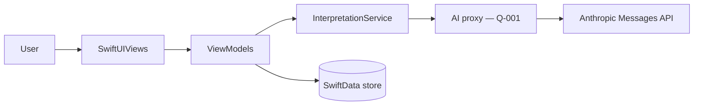

# PDD.md — Product Design & Development Source of Truth

> **Status:** Active
> **Owner:** [You]
> **Last updated:** 2026-07-17
> **Current phase:** Design → Build
> **Version:** 0.1.0

---

## 0. Agent Operating Contract

This file is the shared product source of truth for every human and AI agent working in this repository.

### Mandatory workflow before editing

1. Read this section.
2. Read **Section 1: Product Core**.
3. Use **Section 4: Repository Map** to locate the smallest relevant file or folder.
4. Read only the files required for the current task.
5. Check **Section 5: Current State** and **Section 6: Active Plan**.
6. State the intended files to change before making changes.
7. Make the smallest coherent change.
8. Run the relevant validation commands from **Section 8**.
9. Update this `PDD.md` only when product truth, architecture, repository structure, interfaces, decisions, or current status changed.

### Hard rules

- Do not scan or read the entire repository unless the task genuinely requires it.
- Do not edit a file before locating it through the Repository Map or a targeted search.
- Do not duplicate product truth across multiple documents.
- Do not invent requirements. Mark missing information as `TBD`.
- Do not silently change scope, architecture, data contracts, security assumptions, or user flows.
- Do not create a new file when an existing file has the same responsibility.
- Do not rewrite unrelated code while completing a focused task.
- Do not load generated files, build outputs, dependency folders, large datasets, or lockfiles unless directly relevant.
- Prefer precise searches, file excerpts, diffs, and symbol-level navigation over whole-file or whole-repository reads.
- Treat this file as an index and decision record, not as a dump of implementation details.
- **Design fidelity rule:** `design/prototype.jsx` is the visual and content reference. Do not restyle screens from imagination; translate what the prototype does (Section 9 defines the translation).

### Context-saving protocol

`PDD.md → relevant section → repository map → targeted file search → minimal file reads → edit → test → concise update`

Avoid: `full repository scan → broad exploration → speculative edits → repeated rereading`

### Standard task response

Before implementation:

```text
Task:
Relevant PDD sections:
Files expected to change:
Validation:
Assumptions or blockers:
```

After implementation:

```text
Changed:
Validated:
PDD updates:
Remaining risks:
```

---

## 1. Product Core

### 1.1 Product name

Dream Interpreter (working title; App Store name TBD)

### 1.2 One-sentence definition

A native iOS app (Swift / SwiftUI) that lets a person record a dream in seconds and receive one calm, honest reading synthesized from six interpretive traditions, with a private journal that reveals patterns over time.

### 1.3 Main aim

Turn a half-remembered dream into a usable moment of self-reflection within two minutes of waking, without mysticism-as-fact or clinical dryness.

### 1.4 Problem

People wake with vivid dreams and no good way to make sense of them: dream dictionaries are shallow and contradictory, single-school interpretations (only Freud, only folklore) feel dogmatic, and notes apps capture the dream but interpret nothing. The moment of curiosity is lost by breakfast.

### 1.5 Proposed solution

Capture by text or native voice dictation → one AI request returns a structured reading through six lenses (Zhougong, Freudian, Jungian, neuroscience, cultural symbolism, spiritual), each with an explicit weight and stated contribution → a single synthesis with main message, concerns, opportunities/warnings, reflection questions, and gentle actions → readings persist on device in a journal, and an insights dashboard aggregates recurring symbols, emotions, frequency, and emotional trend.

### 1.6 Core product principles

1. **Reflections, not predictions.** Every reading is framed as self-exploration; never fortune-telling, never diagnosis.
2. **Show the reasoning.** Each lens declares its weight and what it contributed; the synthesis is transparent, not oracular.
3. **Calm and premium.** Night-garden glassmorphism, generous space, no gamification, no streaks, no pressure mechanics.
4. **Private by default.** Dreams are intimate data; they live on device, are never logged, and leave the device only to generate the reading.

### 1.7 Success criteria

| Metric / outcome | Target | Measurement method | Status |
|---|---:|---|---|
| Capture-to-reading time | ≤ 60 s p50 | In-app timing (local analytics) | Not started |
| Reading completion (user scrolls to synthesis) | ≥ 70% | Local analytics | Not started |
| D7 retention of users with ≥ 3 dreams | ≥ 25% | TBD (analytics decision, see Q-002) | Not started |
| Crash-free sessions | ≥ 99.5% | Xcode Organizer / MetricKit | Not started |

### 1.8 Non-goals

- No social features, sharing feeds, or public dream content.
- No Android, web, or iPad-optimized layout in v1 (iPhone-first; iPad runs scaled).
- No account system in v1; no cloud sync in v1 (candidate for v2 via CloudKit).
- No claims of medical, psychological, or predictive validity anywhere in UI copy.
- No subscription/paywall in v1 (monetization is a later decision).

---

## 2. Users and Use Cases

### 2.1 Primary users

| User type | Need | Current pain | Expected value |
|---|---|---|---|
| Morning reflector (journals, meditates) | Quick meaning-making after waking | Dream dictionaries are shallow; notes apps interpret nothing | A 60-second ritual that produces genuine reflection |
| Curious dreamer (occasional vivid dreams) | Understand one striking dream | Contradictory Google results, single-school dogma | Six perspectives + one honest synthesis |
| Pattern seeker (recurring dreams/themes) | See what repeats over weeks | No tool connects dreams over time | Dashboard of recurring symbols, emotions, trend |

### 2.2 Main use cases

| ID | Use case | Trigger | Expected result | Priority |
|---|---|---|---|---|
| UC-001 | Capture dream by text | User opens app after waking | Text saved to draft, ready to interpret | Must |
| UC-002 | Capture dream by voice | User taps mic | Native dictation transcribes into the draft | Must |
| UC-003 | Generate reading | User taps "Interpret this dream" | Full structured reading in ≤ 15 s p90, with analyzing state | Must |
| UC-004 | Explore the six lenses | User expands a lens card | Full interpretation + "contributed" note + weight | Must |
| UC-005 | Save to journal | User taps save | Reading persists on device; appears as journal card | Must |
| UC-006 | Revisit a past dream | User taps a journal card | Stored reading reopens fully | Must |
| UC-007 | View insights | User opens Insights tab | Symbols, emotions, frequency, trend computed from stored dreams | Must |
| UC-008 | Delete a dream | Swipe/long-press → confirm | Dream and reading removed | Must |
| UC-009 | First-run onboarding | First launch | 2–3 screens establishing tone + privacy promise | Should |

### 2.3 Main user journey

1. Wake, open app → "Good morning. What did you dream last night?" with breathing orb.
2. Dictate or type the dream; tap **Interpret this dream**.
3. Analyzing state (orb + staged status lines) while the request runs.
4. Reading appears: summary + confidence ring + tone chips → six lens cards → contribution bar → synthesis → message/concerns/opportunities/questions/actions.
5. Save to journal; over weeks, Insights shows the patterns.

### 2.4 Edge cases

- Empty or < 10-character dream text → interpret button disabled with gentle hint.
- Network offline → calm error state, dream draft preserved, retry available; never lose the text.
- AI returns malformed JSON → one automatic retry with validation errors fed back; then friendly failure state.
- Mic/speech permission denied → fall back to text with a one-line explanation, deep link to Settings.
- Very long dream (> 2,000 chars) → soft counter, truncation warning before send.
- 0–2 saved dreams → Insights shows honest small-sample state ("patterns appear around 8–10 dreams").
- App killed mid-request → draft restored on relaunch; no partial reading saved.

---

## 3. Scope and Requirements

### 3.1 Current release goal

v1.0 on the App Store: capture (text + voice) → six-lens reading → on-device journal → insights dashboard, matching the prototype's design language, iPhone, iOS 17+.

### 3.2 Functional requirements

| ID | Requirement | Priority | Acceptance criteria | Status |
|---|---|---|---|---|
| FR-001 | Text capture with draft persistence | Must | Draft survives app relaunch | Planned |
| FR-002 | Voice capture via SFSpeechRecognizer | Must | Live transcription into draft; graceful permission fallback | Planned |
| FR-003 | Interpretation request returning schema-valid reading | Must | Decodes into `ReadingDTO`; retry-on-invalid works | Planned |
| FR-004 | Reading screen: summary, confidence ring, tone chips | Must | Matches prototype layout; ring animates to value | Planned |
| FR-005 | Six expandable lens cards with weight + contribution | Must | All six render; expand/collapse animated | Planned |
| FR-006 | Contribution bar (stacked weights, legend) | Must | Segments sum to 100% | Planned |
| FR-007 | Synthesis + five sections (message, concerns, opps/warnings, questions, actions) | Must | All sections render from DTO | Planned |
| FR-008 | Journal: save, list cards, reopen, delete | Must | Data survives relaunch; delete confirmed | Planned |
| FR-009 | Insights: symbols, emotions, frequency (14 nights), balance trend | Must | Computed from stored data; small-sample states | Planned |
| FR-010 | Onboarding (tone + privacy) | Should | Shown once; skippable | Planned |
| FR-011 | Demo dream ("giant mosquito") available as sample | Should | One tap loads sample; produces canned reading offline | Planned |

### 3.3 Non-functional requirements

| ID | Area | Requirement | Target |
|---|---|---|---|
| NFR-001 | Performance | Cold launch to capture screen | ≤ 2 s on iPhone 12 |
| NFR-002 | Performance | Interpretation round-trip | ≤ 15 s p90, with staged progress UI |
| NFR-003 | Reliability | Zero data loss of drafts and saved readings | 100% across kill/relaunch tests |
| NFR-004 | Accessibility | VoiceOver on all screens; Dynamic Type up to XL; Reduce Motion honored (orb/aurora stop) | Pass manual audit |
| NFR-005 | Privacy | Dream text never written to logs or analytics | Code-review checklist item |

### 3.4 Out of scope for this release

- iCloud sync, widgets, watchOS, Live Activities, notifications/reminders, sharing/export, localization beyond English, paywall.

### 3.5 Definition of done

A feature is done only when:

- Acceptance criteria pass.
- Relevant automated and manual tests pass.
- Error and empty states are handled.
- Security and privacy impact has been checked (esp. NFR-005).
- User-facing text and accessibility have been reviewed.
- Documentation and Repository Map are updated when needed.
- No unrelated changes are included.

---

## 4. Repository Map

> First place agents use to locate implementation files. Update whenever structure changes.

### 4.1 Top-level map

| Path | Type | Responsibility | Read when | Do not use for |
|---|---|---|---|---|
| `PDD.md` | Source of truth | Product, plan, architecture index, decisions, current state | Every task | Implementation detail |
| `CLAUDE.md` | Claude Code entrypoint | Points to this file + tool-specific rules only | Claude Code sessions | Product truth |
| `README.md` | Human onboarding | Setup and basic usage | Initial setup | Active planning |
| `design/prototype.jsx` | Design reference | Canonical look, motion, copy tone, screen structure (web prototype) | Any UI work | Compiling / importing into app |
| `DreamInterpreter/` | Source | SwiftUI application code | Product implementation | Generated output |
| `DreamInterpreterTests/` | Tests | Unit tests (DTO decoding, aggregation, services) | Logic changes | Requirements |
| `DreamInterpreterUITests/` | Tests | UI flow tests | Flow changes | Requirements |
| `docs/` | Supporting docs | Detailed references indexed in 4.5 | When linked | Duplicate truth |

### 4.2 Feature-to-file index

| Product area / feature | Primary files | Supporting files | Tests | Notes |
|---|---|---|---|---|
| App entry & tabs | `DreamInterpreter/App/DreamInterpreterApp.swift`, `App/RootTabView.swift` | `App/AppState.swift` | UI tests | 3 tabs: Tonight / Journal / Insights |
| Design system | `Core/DesignSystem/Tokens.swift` | `GlassCard.swift`, `OrbView.swift`, `ConfidenceRing.swift`, `AuroraBackground.swift`, `ToneChip.swift` | Snapshot TBD | Mirrors prototype tokens (Section 9) |
| Capture (Tonight) | `Features/Capture/CaptureView.swift`, `CaptureViewModel.swift` | `Core/Services/SpeechService.swift` | Unit + UI | Draft persistence via SwiftData |
| Analyzing state | `Features/Capture/AnalyzingView.swift` | — | UI | Driven by request lifecycle |
| Reading screen | `Features/Reading/ReadingView.swift`, `ReadingViewModel.swift` | `LensCard.swift`, `ContributionBar.swift`, `SectionViews.swift` | Unit + UI | Renders `ReadingDTO` |
| Interpretation service | `Core/Services/InterpretationService.swift` | `Core/Networking/APIClient.swift`, `Core/Models/ReadingDTO.swift` | Unit (fixtures) | JSON schema owner = `ReadingDTO.swift` |
| Journal | `Features/Journal/JournalView.swift`, `JournalCard.swift` | `Core/Models/*` (SwiftData) | Unit + UI | Delete with confirm |
| Insights | `Features/Insights/InsightsView.swift`, `InsightsViewModel.swift` | `Charts` (Swift Charts) | Unit (aggregation) | All stats computed, none hardcoded |
| Onboarding | `Features/Onboarding/OnboardingView.swift` | — | UI | Replaces web landing page |
| Sample dream | `Core/Fixtures/SampleDream.swift` | canned `ReadingDTO` fixture | Unit | Mosquito dream; offline demo path |

### 4.3 Important symbols and entry points

| Symbol / entry point | File | Responsibility |
|---|---|---|
| `DreamInterpreterApp` | `App/DreamInterpreterApp.swift` | App entry, SwiftData container, onboarding gate |
| `InterpretationService` | `Core/Services/InterpretationService.swift` | Build prompt → call API → decode/retry → `ReadingDTO` |
| `ReadingDTO` | `Core/Models/ReadingDTO.swift` | The AI JSON contract (single source of schema truth) |
| `Dream`, `Reading`, `LensReading` | `Core/Models/` | SwiftData persistence models |
| `SpeechService` | `Core/Services/SpeechService.swift` | Permission, live transcription, teardown |
| `InsightsAggregator` | `Features/Insights/InsightsAggregator.swift` | Pure functions: symbols/emotions/frequency/trend |

### 4.4 Files and folders normally excluded from agent context

- `DerivedData/`, build products, `.xcresult` bundles.
- Asset catalogs' binary contents unless the task concerns assets.
- `design/prototype.jsx` full-file reads when only one screen is relevant — read the matching section.
- Test fixtures' long JSON bodies unless editing the schema.

### 4.5 Supporting document index

| Document | Purpose | Read when |
|---|---|---|
| `docs/interpretation-prompt.md` | The system prompt sent to the AI, with the JSON schema and lens definitions | Changing reading quality, schema, or lenses |
| `docs/design-translation.md` | (Create only if Section 9 proves insufficient) prototype→SwiftUI mapping details | Complex UI ports |

---

## 5. Current State

### 5.1 Working now

- Web prototype complete (`design/prototype.jsx`): landing + full app flow with demo content — reference only, not shipping code.

### 5.2 Partially working

- TASK-001 implemented, **build not yet verified on macOS**: Xcode 16 project (objectVersion 77, filesystem-synchronized groups) with app + unit test + UI test targets, shared scheme, SwiftData container over `Dream`/`Reading`/`LensReading`, and the three-tab shell (system `TabView` with placeholder screens). Authored in a Linux agent session without Xcode; the first person/agent on macOS must run the PDD 8.2 build + test commands and record the result in 5.4.
- TASK-002 implemented, same verification caveat: `Tokens.swift` (colors, glass recipe, CTA gradient, motion durations), `AuroraBackground` (gradient + three drifting glows + stars, stills under Reduce Motion), `GlassCard` view + `.glassCard()` modifier, and `TokenPreview` (dev-only screen for the prototype color comparison). Feature screens do not use them yet — wiring happens in TASK-004/006.
- TASK-003 implemented, same verification caveat: `OrbView` (radial-gradient sphere + pulsing halo ring, 4.5 s breathe, freezes under Reduce Motion) and `ConfidenceRing` (lavender→teal diagonal-gradient progress ring animating to value on appear, VoiceOver label). Both added to `TokenPreview` for side-by-side comparison.
- TASK-005 implemented, test run pending on macOS: `ReadingDTO`/`LensReadingDTO` (Core/Models/ReadingDTO.swift) with `decode(from:)` validating required fields, confidence/balanceScore ranges, and exactly-six-unique-lenses, then normalizing lens weights to sum to 100 by largest-remainder rounding (PDD 7.5). `SampleDream` (Core/Fixtures/SampleDream.swift) carries the full mosquito reading verbatim from the prototype for FR-011's offline demo path. `DreamInterpreterTests/ReadingDTOTests.swift` covers round-trip, weight normalization, and each validation failure mode. Also fixed a latent bug: `Lens` (Core/Models/LensReading.swift) was missing `Hashable`, needed for `Set<Lens>` validation and already silently required by TASK-003's `ForEach(Lens.allCases, id: \.self)`.
- TASK-004 implemented, manual relaunch pass pending on macOS: `CaptureView` renders the full prototype `InputScreen` (orb + greeting, glass dream-text card with char counter and soft over-2000 warning, mic button, sample-dream suggestion, gradient CTA that enables at 10+ trimmed characters with a gentle hint below when text is present but short). `CaptureViewModel` persists the draft to `UserDefaults` on every change (FR-001; survives relaunch by construction, not just observation) and drives a placeholder voice interaction that mirrors the prototype's own timed demo fill — real dictation is `SpeechService`/FR-002 in M2, not built yet. The "Interpret this dream" button is intentionally a no-op: `InterpretationService` doesn't exist until M2 (Q-001 still open), so it only exercises its enabled/disabled state for now. Tests: `CaptureViewModelTests` (persistence, minimum length, sample fill, soft limit) and one UI test exercising the sample-dream → enabled-CTA path.

### 5.3 Not implemented

- Everything in Section 3.2 (all FRs Planned).

### 5.4 Latest verified build

| Item | Value |
|---|---|
| Commit / version | TBD |
| Environment | TBD (Xcode 16.x, iOS 17 SDK target) |
| Date verified | TBD |
| Verified by | TBD |
| Result | TBD |

---

## 6. Active Plan

### 6.1 Current milestone

**M1 — Foundation & design system:** Xcode project builds; tokens, glass, orb, aurora, ring, chips implemented; three-tab shell with capture screen rendering against mock data, visually matching the prototype.

### 6.2 Work items

| ID | Task | Owner | Relevant files | Dependencies | Status | Validation |
|---|---|---|---|---|---|---|
| TASK-001 | Create Xcode project, targets, SwiftData container, tab shell | Agent | `App/*` | — | Implemented — simulator verification pending (authored off-macOS) | Builds + launches in simulator |
| TASK-002 | Port design tokens + `AuroraBackground` + `GlassCard` | Agent | `Core/DesignSystem/*` | TASK-001 | Implemented — preview comparison pending (authored off-macOS) | Token preview screen matches prototype colors |
| TASK-003 | `OrbView` (breathe animation, Reduce Motion aware) + `ConfidenceRing` | Agent | `Core/DesignSystem/*` | TASK-002 | Implemented — preview comparison pending (authored off-macOS) | Previews; motion stops with Reduce Motion |
| TASK-004 | Capture screen UI with draft persistence | Agent | `Features/Capture/*` | TASK-002 | Implemented — manual relaunch pass pending (authored off-macOS) | Draft survives relaunch (unit + manual) |
| TASK-005 | `ReadingDTO` + sample mosquito fixture + decoding tests | Agent | `Core/Models/`, `Core/Fixtures/` | — | Implemented — test run pending (authored off-macOS) | Unit tests green |
| TASK-006 | Reading screen rendering the fixture | Agent | `Features/Reading/*` | TASK-003, TASK-005 | Planned | All sections render; UI test |

### 6.3 Execution order

1. TASK-001 → 2. TASK-002 → 3. TASK-003 → 4. TASK-005 → 5. TASK-004 → 6. TASK-006

**Later milestones (outline):** M2 speech + live interpretation service (+ `docs/interpretation-prompt.md`); M3 journal persistence + delete; M4 insights aggregation + Swift Charts; M5 onboarding, accessibility audit, App Store prep.

### 6.4 Blockers and open questions

| ID | Question / blocker | Owner | Decision needed by | Status |
|---|---|---|---|---|
| Q-001 | AI access strategy: direct Anthropic API with key in a lightweight proxy backend (recommended) vs. user-supplied key vs. embedded key (rejected — insecure). Proxy stack TBD. | [You] | Before M2 | Open |
| Q-002 | Analytics: none vs. privacy-preserving local-only vs. TelemetryDeck-style. Affects success criteria measurement. | [You] | Before M5 | Open |
| Q-003 | App Store positioning: entertainment/lifestyle framing and disclaimer copy to satisfy review guidelines for interpretation content. | [You] | Before M5 | Open |

---

## 7. Architecture and Data

### 7.1 System overview

Single native iOS app, MVVM with SwiftUI. All user data on device via SwiftData. One outbound call per interpretation to the AI endpoint (through proxy per Q-001), returning strict JSON decoded into `ReadingDTO`, then persisted as SwiftData models.



### 7.2 Components

| Component | Responsibility | Inputs | Outputs | Primary files |
|---|---|---|---|---|
| Capture | Draft entry, dictation | User text/speech | Draft `Dream` | `Features/Capture/*` |
| InterpretationService | Prompt build, request, decode, retry | Dream text | `ReadingDTO` or typed error | `Core/Services/InterpretationService.swift` |
| Reading | Render a reading | `ReadingDTO` / stored `Reading` | Save action | `Features/Reading/*` |
| Journal | Persist + browse | SwiftData | Selected reading | `Features/Journal/*` |
| InsightsAggregator | Pure aggregation | `[Dream]` | Stats structs | `Features/Insights/InsightsAggregator.swift` |
| SpeechService | Dictation lifecycle | Mic audio | Transcribed text stream | `Core/Services/SpeechService.swift` |

### 7.3 Data model

| Entity / model | Purpose | Key fields | Relationships | Source file |
|---|---|---|---|---|
| `Dream` | A captured dream | id, createdAt, text, title, symbols: [String] | 1—1 `Reading` | `Core/Models/Dream.swift` |
| `Reading` | The interpretation | summary, confidence, tones, synthesis, mainMessage, concerns, opportunities(kind,text), questions, actions, balanceScore | 1—6 `LensReading` | `Core/Models/Reading.swift` |
| `LensReading` | One lens's take | lens (enum: zhougong/freud/jung/neuro/culture/spirit), short, full, contributed, weight | belongs to `Reading` | `Core/Models/LensReading.swift` |
| `ReadingDTO` | Wire contract (Codable) | Mirrors above + validation | — | `Core/Models/ReadingDTO.swift` |

### 7.4 External interfaces

| Interface | Direction | Purpose | Contract / source | Failure behavior |
|---|---|---|---|---|
| AI interpretation endpoint | Outbound | Generate reading JSON | `ReadingDTO.swift` + `docs/interpretation-prompt.md` | Retry once with validation feedback → calm error state, draft preserved |
| SFSpeechRecognizer / AVAudioEngine | On-device/system | Dictation | Apple frameworks | Fall back to text input |

### 7.5 State and data flow

Views own no state; ViewModels (`@Observable`) hold screen state; SwiftData is the single persistence layer; `InterpretationService` is stateless per request. Draft autosaves on change. Weights normalized to 100 at decode time.

### 7.6 Architecture constraints

- iOS 17+, SwiftUI only (no UIKit screens), Swift Charts for all charts, no third-party UI dependencies.
- No secrets in the app binary or repo (see Q-001).
- All AI-derived content passes through `ReadingDTO` validation before display or persistence.
- Reduce Motion must disable orb/aurora/floating animations globally.

---

## 8. Build, Test, and Release

### 8.1 Local setup

```bash
# Requires Xcode 16.x with iOS 17 SDK
open DreamInterpreter.xcodeproj
# or CLI:
xcodebuild -scheme DreamInterpreter -destination 'platform=iOS Simulator,name=iPhone 15' build
```

### 8.2 Commands

| Purpose | Command | When required |
|---|---|---|
| Build | `xcodebuild -scheme DreamInterpreter -destination 'platform=iOS Simulator,name=iPhone 15' build` | Before completion |
| Unit tests | `xcodebuild test -scheme DreamInterpreter -only-testing:DreamInterpreterTests -destination 'platform=iOS Simulator,name=iPhone 15'` | Logic changes |
| UI tests | `xcodebuild test -scheme DreamInterpreter -only-testing:DreamInterpreterUITests -destination 'platform=iOS Simulator,name=iPhone 15'` | Flow changes |
| Lint | TBD (SwiftLint if adopted) | Every code change |
| Format | Xcode default / `swift-format` TBD | Before completion |

### 8.3 Validation matrix

| Change type | Minimum validation |
|---|---|
| UI copy only | Build + affected screen preview |
| UI behavior | Unit/UI test + manual path in simulator |
| Business logic | Unit tests + affected integration path |
| `ReadingDTO` schema | Decoding tests + prompt doc updated + fixture regenerated |
| Dependency | Build + tests + security review |
| Persistence models | Migration check + kill/relaunch data-loss test |

### 8.4 Environments

| Environment | Purpose | Deployment method | Notes |
|---|---|---|---|
| Local simulator | Development | Xcode | Fixture/offline mode available |
| TestFlight | Validation | App Store Connect | Internal first |
| App Store | Users | App Store Connect | Q-003 before submission |

### 8.5 Release checklist

- [ ] Version updated.
- [ ] Required tests pass.
- [ ] Security/privacy review complete (NFR-005 log audit).
- [ ] Migration and rollback considered.
- [ ] Release notes prepared.
- [ ] Monitoring/analytics decision (Q-002) implemented.
- [ ] App Store metadata, privacy nutrition label, disclaimer copy (Q-003).

---

## 9. Design System and UX Rules

> Canonical reference: `design/prototype.jsx` ("night garden" system). This section defines the SwiftUI translation; when in doubt, match the prototype.

### 9.1 Design principles

- Calm, premium, minimal; dark night-sky base with aurora glow; generous spacing; serif display voice for "dream" content, system sans for UI.
- Motion is slow and breathing (4.5 s orb cycle), never bouncy; everything stills under Reduce Motion.
- One accent action per screen (gradient capsule button); everything else is glass.

### 9.2 Navigation and interaction rules

- Three-tab structure: **Tonight / Journal / Insights** (floating glass capsule tab bar).
- Capture → Analyzing → Reading is a forward flow; back returns to capture with draft intact.
- Lens cards: one expanded at a time (matches prototype accordion behavior).
- Destructive actions always confirm. Touch targets ≥ 44 pt.

### 9.3 Visual tokens

| Token | Value / source |
|---|---|
| Background gradient | `#0B0A1E → #171233 → #221A44` (175°) + 3 aurora radial glows (lavender `#7C6AE8`, teal `#8FE3D2`, rose `#EEA7C4` at low opacity) |
| Ink (text) | primary `#F4F1FF`; soft 64%; faint 40% |
| Accents | lavender `#B9A8F7`, teal `#8FE3D2`, rose `#EEA7C4`, peach `#F2B8A2` |
| Glass surface | white 6.5% fill, white 14% border, radius 24, blur ≈ 24 → SwiftUI: `.ultraThinMaterial` tinted dark + overlay stroke; exact recipe in `Tokens.swift` |
| Primary CTA | linear gradient `#CFC2FA → #9FE8D8`, capsule, dark ink `#171233` |
| Typography | UI: SF Pro (system). Display/dream text: New York serif via `.fontDesign(.serif)`, italic for dream quotes (prototype uses Georgia — New York is the native equivalent) |
| Lens colors | zhougong peach, freud rose, jung lavender, neuro teal, culture `#A8C7F5`, spirit `#F5DFA8` |
| Motion | orb breathe 4.5 s ease-in-out; screen transitions fade+rise ~420 ms; honors Reduce Motion |

### 9.4 Content and localization

- Supported languages: English only (v1).
- Copy tone: warm, plain, honest; questions in serif italic; "Reflections, not predictions · For self-exploration only" appears on capture screen and onboarding.
- User-facing strings in a single `Strings` namespace to ease later localization; no hard-coded scattered text.

### 9.5 Accessibility baseline

- VoiceOver labels on all interactive elements; confidence ring and charts expose value summaries.
- Dynamic Type through XL without truncation of reading content.
- Reduce Motion: orb, aurora drift, floating chips freeze; transitions become plain fades.
- Contrast: soft-ink text ≥ 4.5:1 on glass surfaces (verify tokens in TASK-002).

---

## 10. Security, Privacy, and Compliance

### 10.1 Data classification

| Data | Collected | Storage | Retention | Shared with |
|---|---|---|---|---|
| Dream text + readings | Yes | On-device SwiftData only | Until user deletes | AI endpoint per request only (no retention promise per Q-001 proxy) |
| Speech audio | Transient | Not stored | Discarded after transcription | Apple speech framework per OS behavior |
| Analytics | TBD (Q-002) | TBD | TBD | TBD |

### 10.2 Security rules

- Never commit secrets, tokens, certificates, or private keys. **No AI API key ships in the binary** (Q-001).
- Validate untrusted input — all AI responses decode through `ReadingDTO` before use.
- Do not log dream text, transcripts, or reading content anywhere (NFR-005).
- Apply least privilege: request mic/speech permission only at first mic tap, with purpose strings.
- Review new dependencies (target: zero third-party UI deps).

### 10.3 Privacy and legal requirements

- App Store privacy nutrition label must reflect 10.1 accurately.
- Interpretation content requires clear non-medical, entertainment/self-reflection disclaimer (Q-003).
- Mic + speech recognition usage descriptions in Info.plist with honest copy.

### 10.4 Threats and mitigations

| Threat | Impact | Mitigation | Status |
|---|---|---|---|
| API key extraction from binary | Cost abuse | Proxy architecture (Q-001) | Open |
| Prompt injection via dream text altering reading tone/safety | Misleading output | System prompt hardening + DTO validation + content constraints in `docs/interpretation-prompt.md` | Planned |
| Sensitive dream data in logs/crash reports | Privacy breach | NFR-005 audit + no third-party loggers | Planned |

---

## 11. Decisions

| ID | Date | Decision | Why | Alternatives rejected | Consequences |
|---|---|---|---|---|---|
| ADR-001 | 2026-07-17 | Native Swift/SwiftUI iPhone app, iOS 17+ | Premium feel, native dictation, Swift Charts, SwiftData | React Native, web wrapper (glass/motion fidelity and dictation weaker) | No Android in v1 |
| ADR-002 | 2026-07-17 | SwiftData for persistence | Modern, matches @Observable MVVM, sufficient for on-device journal | Core Data (boilerplate), JSON files (no queries/migrations) | iOS 17 floor |
| ADR-003 | 2026-07-17 | `design/prototype.jsx` is the canonical design reference; Section 9 owns the SwiftUI translation | Prototype's style is approved and liked; avoids redesign drift | Figma redraw (extra work, drift risk) | Agents must read the relevant prototype section for UI tasks |
| ADR-004 | 2026-07-17 | `ReadingDTO.swift` is the single source of schema truth; the prompt doc must match it | Prevents schema drift between prompt and decoder | Schema in prompt doc only | Schema changes require paired updates + fixtures |
| ADR-005 | 2026-07-17 | On-device data only in v1; no accounts | Privacy principle, faster v1 | Cloud-first with auth | Sync deferred to v2 (CloudKit candidate) |

---

## 12. Known Issues, Risks, and Technical Debt

| ID | Type | Description | Impact | Priority | Owner | Planned action |
|---|---|---|---|---|---|---|
| RISK-001 | Risk | Q-001 unresolved blocks M2 (live interpretation) | Schedule | High | [You] | Decide proxy approach before M2 |
| RISK-002 | Risk | App Review sensitivity to "interpretation" apps | Launch delay | Medium | [You] | Q-003 disclaimer + category research before M5 |
| RISK-003 | Risk | Glass blur + aurora animation cost on older devices | Perf | Medium | Agent | Profile in M1; static aurora fallback |
| DEBT-001 | Debt | Web landing page has no iOS equivalent yet (onboarding is a reduced version) | Marketing site later | Low | [You] | Reuse landing design for product web page post-launch |

---

## 13. Change Log

| Date | Change | Reason | Files / areas affected |
|---|---|---|---|
| 2026-07-17 | Initial PDD created for native SwiftUI app; prototype adopted as design reference | Establish shared source of truth | `PDD.md`, `design/prototype.jsx` |
| 2026-07-17 | TASK-001: Xcode project + targets + shared scheme, SwiftData models/container, three-tab shell with placeholder screens; repo seeded with PDD/CLAUDE/prototype | M1 foundation | `DreamInterpreter.xcodeproj/*`, `DreamInterpreter/App/*`, `DreamInterpreter/Core/Models/*`, `DreamInterpreter/Features/*`, test targets |

---

## 14. Archive and References

### 14.1 Archived plans

| Document / section | Reason archived | Date |
|---|---|---|
| `PLAN-A-claude-artifact.md` | Superseded — artifact track complete as prototype | 2026-07-17 |
| `PLAN-B-claude-code.md` (Next.js web track) | Superseded by native iOS direction | 2026-07-17 |

### 14.2 External references

| Reference | Purpose | Authority / owner |
|---|---|---|
| Anthropic API docs — https://docs.claude.com/en/api/overview | Interpretation endpoint contract | Anthropic |
| Apple HIG | Native interaction conventions | Apple |
| SFSpeechRecognizer / Swift Charts / SwiftData docs | Framework usage | Apple |

---

## Maintenance Rules for This File

Update `PDD.md` when: product aim/users/scope/success criteria change; a feature is added, removed, or materially changed; architecture, data models, interfaces, or security assumptions change; files change responsibility; milestone, state, blockers, or durable decisions change; build/test/release commands change.

Do not update for: formatting-only edits, internal refactors without responsibility changes, temporary debugging notes, every small commit, or information owned by another linked source of truth.

Keep it useful: prefer tables and links over long prose; keep the Repository Map current; keep Current State and Active Plan short; archive stale details; never paste large source files, logs, API responses, or chat transcripts here.
